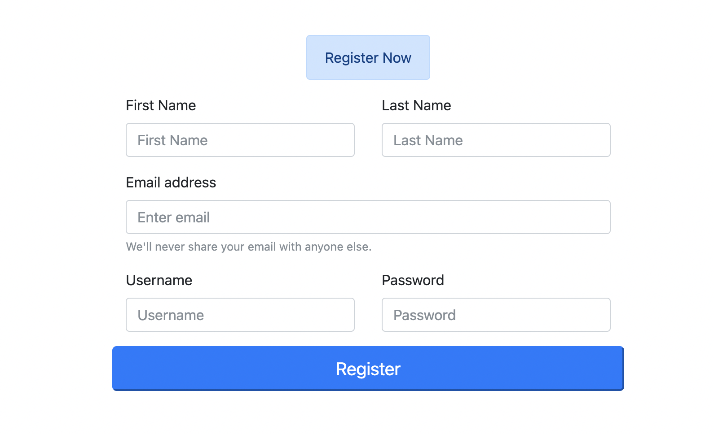
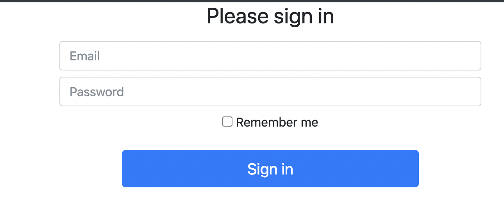
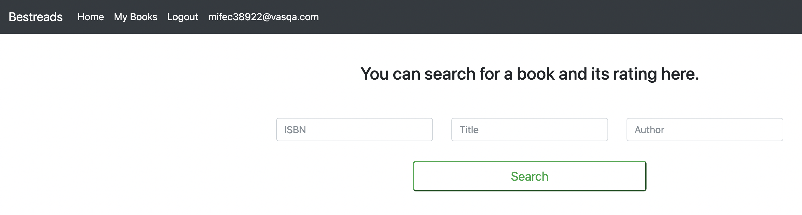
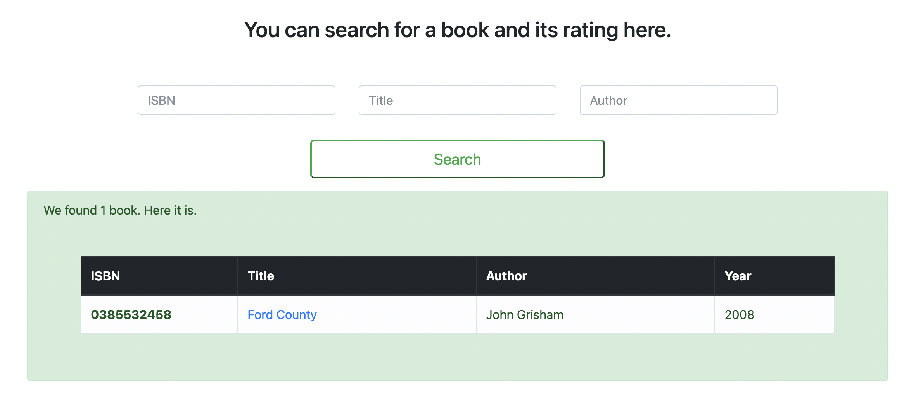
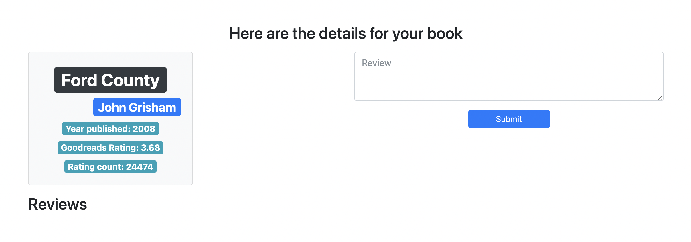
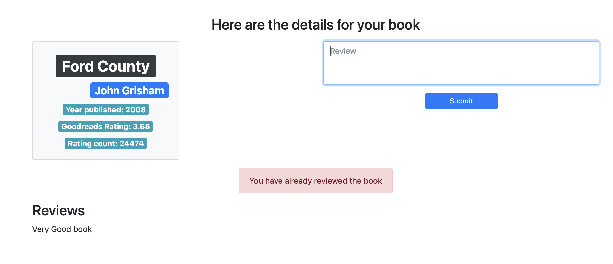

## Book Search and Review Website

- Project developed when learning about flask, SQLAlchemy
- Users can register to search and review books.
- It stores the books listed in `books.csv` file in the database.
- The app searches for a book based on ISBN, Title or Author from the books stored in the database
- The book's review can be fetched from Goodreads and the user can add review comment.

### How to run the app locally?
- run `pip install -r requirements.txt` to install the required libraries.
- Then run `bash load_data.sh` to load the data in the database.
- Finally, run the app locally by executing `bash run.sh` script

### Usage
- `127.0.0.1:5000` : opens home page
- Click on register at top left and enter the details.

- On successful registration a user is created in the DB and login window opens.
- Enter the email and password details.

- On successful login a search form is provided where you can search on the basis of ISBN, Title or Author.

- If your search is successful it returns a result as seen in the screenshot.

- If you click on title's link, it fetches review details of the book from Goodreads.

- In the review box you can submit a review which is then displayed along with the book.
- One User can submit only one review for a particular book

- Finally by clicking on the logout link at top you can log out which returns you to home page.
